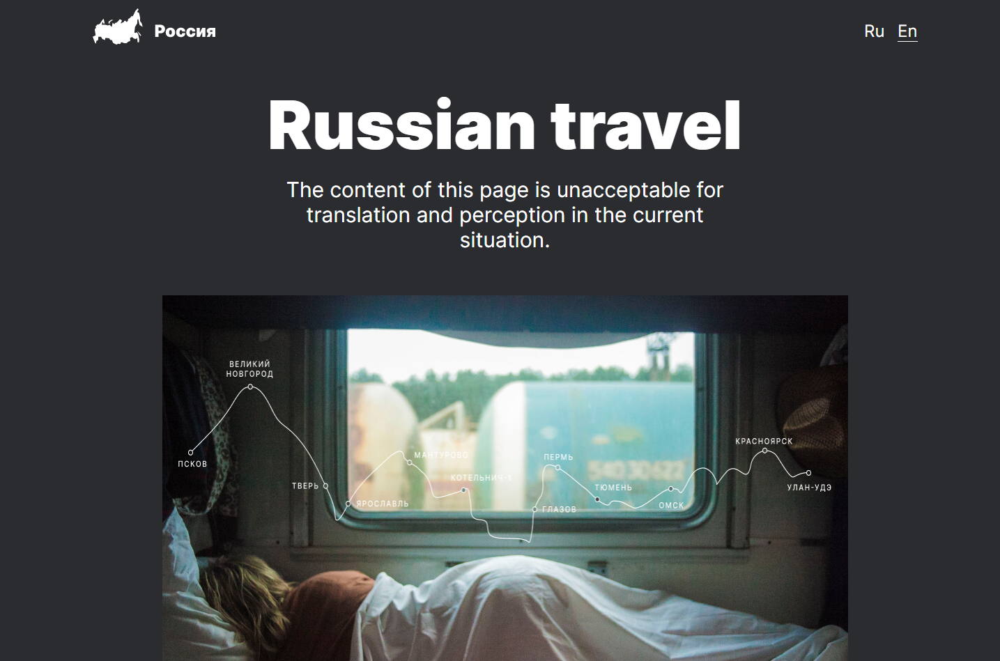

# [Russian travel](https://podogas.github.io/russian-travel/)

## Description:
This was the second training project of Yandex practicum courses.
One of the main challenges was in creating adaptive layout for all devices, regardless of their screen size.
## In this project i was using following technologies and methods:
* HTML with BEM as naming convention for classes.
* flexbox
* grid-layout
* scalable units (em, rem) & calc function

  
